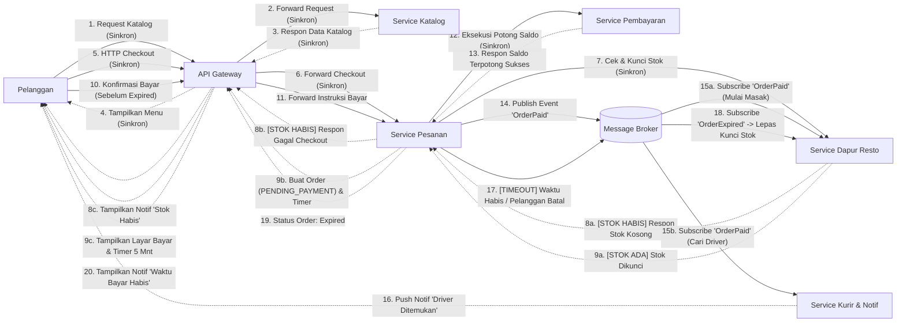

# Tugas 2 (Pekan 2) — Perancangan Arsitektur untuk FoodGo

**Materi terkait:** Architectural style (Layered, SOA, Peer-to-Peer, Publish-Subscribe).

## Studi Kasus

Melanjutkan Tugas 1: FoodGo butuh sistem yang **decoupled** agar tim kurir dan tim resto tidak saling mengganggu ketika salah satu modul diperbarui/deploy ulang. Saat ini semua modul (pesanan, pembayaran, notifikasi kurir, katalog resto) berjalan sebagai satu aplikasi monolitik — sekali deploy, semua modul ikut restart dan berisiko downtime total.

## Tugas Kelompok

1. Pilih **satu** gaya arsitektur utama: **Service-Oriented Architecture (SOA)** atau **Publish-Subscribe**. Boleh dikombinasikan (mis. SOA untuk service inti + Pub-Sub untuk notifikasi), tapi harus dijustifikasi kenapa kombinasi ini yang dipilih.
2. Gambarkan minimal 4 komponen berikut dan interaksinya: modul Pesanan, modul Pembayaran, modul Kurir/Notifikasi, modul Katalog Resto (dan message broker/API gateway jika relevan).
3. Jelaskan alur satu skenario penuh secara end-to-end di diagram (misalnya: pelanggan buat pesanan → bayar → resto terima notifikasi → kurir ditugaskan) — tunjukkan komponen mana berkomunikasi dengan siapa, dan **jenis komunikasinya** (sinkron/asinkron, request-response/event).
4. Analisis tertulis: kenapa gaya ini mengatasi masalah *coupling* dari Tugas 1, dan apa trade-off-nya (mis. Pub-Sub menambah kompleksitas debugging karena alur tidak linear).

## Cara Membuat Diagram (Gratis, Cukup Laptop)

Tidak perlu software berbayar. Dua opsi:

**Opsi A — Mermaid di dalam Markdown (disarankan).** Ditulis sebagai teks biasa di `README.md`, otomatis dirender jadi diagram oleh GitHub — tidak perlu install apa pun.


**Opsi B — draw.io / diagrams.net** (gratis, jalan di browser tanpa akun, atau app desktop offline di [app.diagrams.net](https://app.diagrams.net/)). Ekspor sebagai `.png` dan simpan di folder `diagram/`.

## Struktur Submission

```
tugas-02-perancangan-arsitektur/
├── README.md          # Analisis + diagram Mermaid (jika Opsi A) atau referensi ke diagram/
├── JURNAL.md
└── diagram/            # File .png/.drawio jika pakai Opsi B
```

## Rubrik Penilaian (Tugas 2)

| Komponen | Bobot | Kriteria |
|---|---|---|
| Ketepatan pemilihan gaya arsitektur | 20% | Justifikasi SOA/Pub-Sub sesuai kebutuhan *decoupling* di skenario |
| Kelengkapan & kejelasan diagram | 30% | Semua komponen kunci ada, jenis komunikasi (sinkron/asinkron) jelas ditandai |
| Analisis trade-off | 30% | Bukan hanya kelebihan — kekurangan/kompleksitas baru juga dibahas |
| Proses & kontribusi kelompok | 20% | `JURNAL.md`, commit history |

## Batasan Penggunaan AI (Level 2)

Kebijakan **Level 2 (AI Assisted Idea Generation & Structuring)** berlaku — lihat [`../RUBRIK-UMUM.md`](../RUBRIK-UMUM.md). Boleh memakai AI untuk brainstorming komponen apa saja yang umum ada di gaya arsitektur SOA/Pub-Sub; **tidak boleh** meminta AI menggambar diagram final atau menuliskan analisis trade-off yang tinggal ditempel. Catat pemakaian AI di "Log Penggunaan AI" pada `JURNAL.md`.

- Diagram Mermaid/draw.io yang "terlalu generik" (identik dengan contoh tutorial di internet tanpa penyesuaian ke kasus FoodGo) akan dinilai rendah pada komponen kelengkapan & kejelasan diagram.


## Analisis Jawaban

1. Kami memilih mengkombinasikan dua arsitektur **Service-Oriented Architecture (SOA)** dan **Publish-Subscribe**. Kita menerapkan SOA (komunikasi sinkron) pada interaksi yang berhadapan langsung dengan pelanggan yang butuh data aktual. Saat aplikasi memuat daftar menu dari Service Katalog atau memproses transaksi di Service Pembayaran, alurnya berjalan sebagai request-response langsung. Pelanggan mendapatkan validasi dan kepastian di detik yang sama bahwa uang mereka diterima dan pesanan tercatat.

Setelah pembayaran dikonfirmasi, sistem  menggunakan Pub-Sub (komunikasi asinkron) untuk mengurus operasional lanjutan. Service Pesanan tidak perlu lagi repot-repot menghubungi restoran atau mencari pengemudi; ia hanya menyiarkan satu event "Pesanan Lunas" ke dalam Message Broker dan tugas utamanya pun selesai. Service Dapur dan Service Kurir bertindak sebagai subscriber independen yang mengambil event tersebut dan mengeksekusinya secara paralel. Karena mereka dipisahkan oleh broker, jika tim kurir memutuskan untuk me-restart server mereka, tim resto tidak akan merasakan dampaknya dan tetap bisa menerima pesanan seperti biasa.

2. Diagram:



3. Skenario pemesanan makanan pada sistem FoodGo dengan menggunakan pendekatan hibrida (SOA dan Publish-Subscribe):
    1. Fase Inisiasi dan Katalog
        Proses diawali ketika klien (pelanggan) mengakses antarmuka aplikasi untuk memuat daftar menu restoran. Klien mengirimkan permintaan melalui API Gateway, yang kemudian diteruskan ke Service Katalog menggunakan komunikasi sinkron berbasis request-response.             Pendekatan sinkron pada fase ini penting untuk menjamin klien memperoleh representasi data yang paling aktual secara real-time.

    2. Fase Pemesanan dan Validasi Pembayaran
        Saat klien checkout, request dikirimkan secara sinkron (request-response) melalui API Gateway menuju Service Pesanan. Untuk menjamin validitas transaksi, Service Pesanan selanjutnya melakukan pemanggilan langsung ke Service Pembayaran secara sinkron          (request-response).
        Sifat sinkron pada titik ini penting karena sistem membutuhkan kepastian terkait pemotongan saldo. Apabila Service Pembayaran menolak transaksi atau mengalami timeout, Service Pesanan akan langsung menggagalkan alur tersebut dan mengembalikan respons         kegagalan (error response) kepada klien melalui API Gateway. Pada tahap ini, klien menerima notifikasi "Pembayaran Berhasil" atau "Gagal".

    3. Transisi Alur Komunikasi
        Pasca-keberhasilan pemotongan saldo, arsitektur secara fundamental bertransisi ke pola Publish-Subscribe. Service Pesanan tidak lagi melakukan pemanggilan langsung ke modul lain, melainkan memublikasikan sebuah pesan event dengan label PaymentConfirmed ke dalam Message Broker. Komunikasi ini bersifat asinkron berbasis event. Setelah event terkirim, Service Pesanan segera menyelesaikan beban kerjanya (fire-and-forget).

    4. Pemrosesan Operasional
        Di sisi lain dari Message Broker, Service Dapur Resto dan Service Kurir beroperasi sebagai subscriber yang sepenuhnya terisolasi satu sama lain. Keduanya mengonsumsi event PaymentConfirmed dari broker secara asinkron (event-driven).
Pemisahan ini memungkinkan kedua layanan bekerja secara paralel: restoran mulai menyiapkan makanan, sementara sistem kurir mulai melakukan penugasan (dispatching) pengemudi. Kegagalan atau latensi pada sistem pencarian kurir tidak akan mengganggu atau menunda operasional dapur resto.

    5. Pengiriman Pembaruan Status ke Klien
        Setelah Service Kurir berhasil mengalokasikan pengemudi, pembaruan status (misalnya: "Kurir sedang menuju restoran") didorong kembali ke perangkat klien. Proses ini tidak menggunakan jalur request-response tradisional melalui API Gateway, melainkan dikirimkan secara asinkron berbasis event menggunakan protokol push notification (seperti WebSocket), yang memungkinkan sistem memperbarui antarmuka pengguna di latar belakang.

    6. Jalur Kompensasi / Alternatif
        Dalam skenario pengecualian, sebagai contoh, apabila stok bahan baku habis, Service Dapur tidak dapat merespons klien secara langsung. Sebagai mitigasi, Service Dapur akan memublikasikan event balasan OrderRejected ke dalam Message Broker secara asinkron. Event ini selanjutnya akan dikonsumsi oleh Service Pembayaran untuk mengeksekusi pengembalian dana (refund) secara otomatis, serta Service Kurir akan menghentikan proses pencarian pengemudi.
