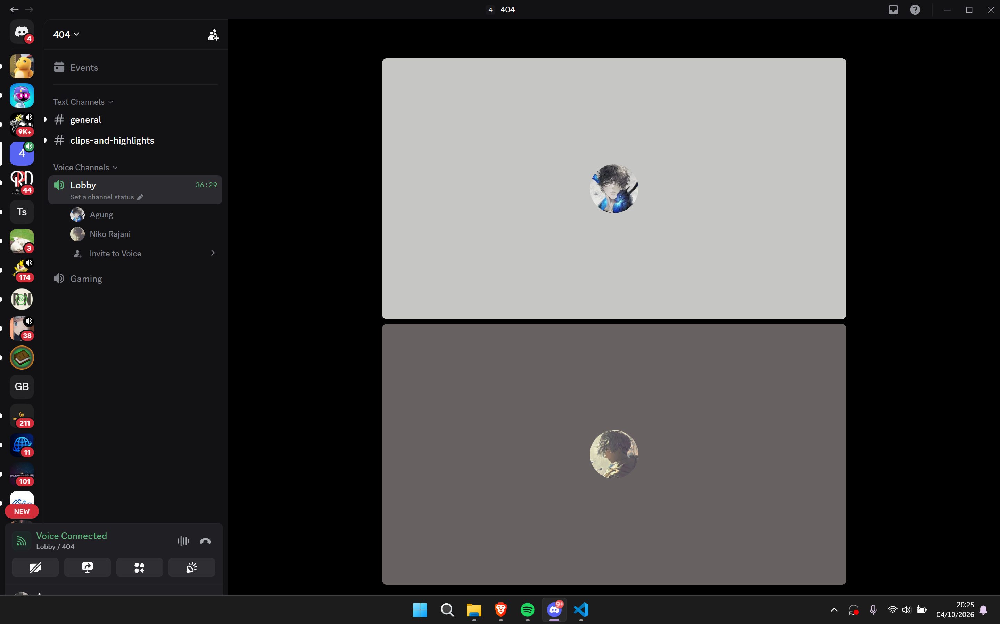
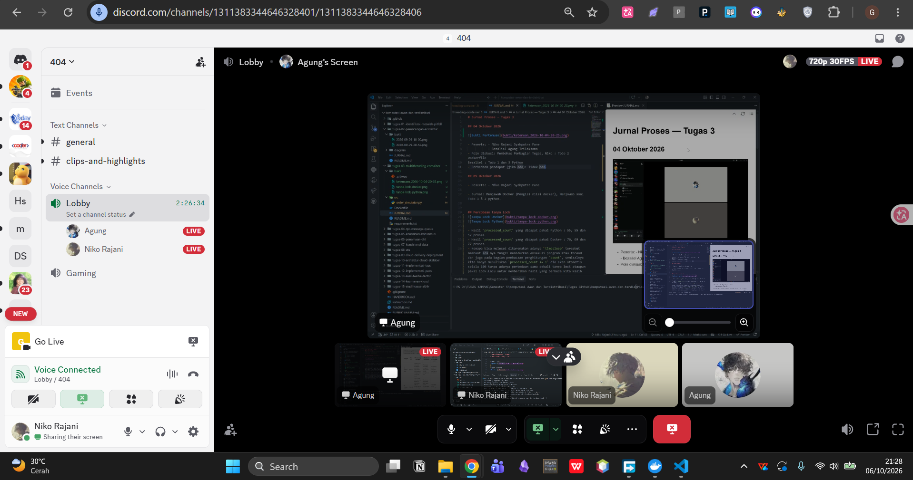
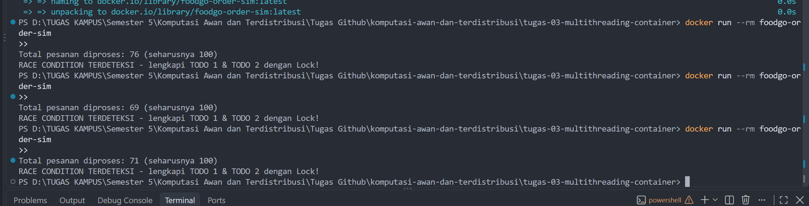
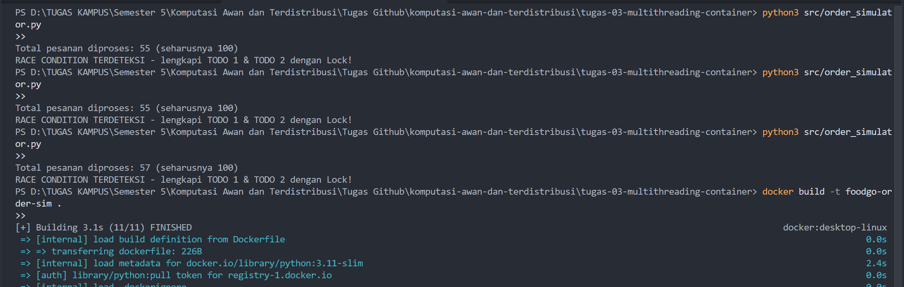

# Jurnal Proses — Tugas 3

## 04 Oktober 2026



- Peserta: - Niko Rajani Syahputra Pane
           - Bezaliel Agung Trilaksana
- Poin diskusi: Membahas Pembagian Tugas, Niko : Todo 2 Dockerfile 
Bezaliel : Todo 1 dan 3 Python 
- Perbedaan pendapat (jika ada): Tidak ada. 

## 05 Oktober 2026

- Peserta: - Niko Rajani Syahputra Pane

- Jurnal: Menjawab Docker (Mengisi nilai docker), Menjawab soal Todo 1 & 2 python. 


## 06 Oktober 2026
- Peserta: - Niko Rajani Syahputra Pane
           - Bezaliel Agung Trilaksana
- Poin diskusi: Membahas soal perbedaan hasil dengan yang seharusnya. Awal nya kami menjalankan tanpa lock dan tidak terjadi race condition. tetapi setelah menambahkan time sleep di todo 2, kami berhasil mendapatkan situasi race condition untuk tanpa lock.
- Perbedaan pendapat (jika ada): Tidak ada. 


## Percobaan tanpa Lock



- Hasil `processed_count` yang didapat pakai Python : 55, 55 dan 57 proses
- Hasil `processed_count` yang didapat pakai Docker : 76, 69 dan 77 proses
- Kenapa bisa meleset dikarenakan adanya `timesleep` tersebut membuat ada nya fungsi menidurkan eksekusi program atau thread dan juga pada bagian pembacaan penghitungan `count`, semisalnya kita hanya menuliskan `processed_count += 1` dia akan otomatis selalu 100 tanpa adanya perbedaan sama sekali tanpa lock ataupun pakai lock.Lalu untuk memberikan hasil yang berbeda kita kasih berupa deklarasi awal terlebih dahulu yaitu `current_count` setelah itu kita `timesleep` lagi agar memberikan waktu yang berbeda.kenapa deklarasi `current_count`  tidak diberikan pada bagian atas `time.sleep(random.uniform(0.001, 0.01))` sebab untuk mencapai target 100 hasil progres nya selalu rendah diantara 10-20 an.
- disini hasil proses hitung antara Python dengan Docker terlihat sangat berbeda diakibatkan thread bekerja sangat liar untuk mengeksekusi variabel tersebut, dan mengakibatkan _context switching_ (pergantian tugas antar thread) sedangkan Docker dia sangat alih dalam _context switching_ mengakibatkan hasil dari proses hitung tersebut agak lebih tinggi dibandingkan saat menjalankan python langsung  
  
## Percobaan dengan Lock
- Hasil `processed_count` setelah perbaikan: 
Pesanan 100 baik di jalankan pakai python langsung maupun pakai docker. 

Dengan python:
.png)

Dengan docker:
.png)

Berdasarkan hasil eksekusi diatas, kita dapat lihat bahwa ketika kita membungkus perhitungan dengan with lock, kita pada dasarnya memberlakukan sistem antrean tunggal yang ketat (Mutual Exclusion). Baik program ini dijalankan di laptop secara langsung (Menggunakan python) atau di dalam Docker, aturannya tetap berlaku.

``` python
with lock:
    sementara = processed_count
    time.sleep(0.00001) 
    processed_count = sementara + 1
```
Sintaks with *lock* bertindak sebagai penjaga pintu otomatis. Saat sebuah pekerja (thread) memasuki blok ini, sistem langsung mengunci variabel tersebut. Sekalipun pekerja pertama tertidur di tengah perhitungan akibat perintah time.sleep, pekerja kedua yang baru datang sama sekali tidak bisa menerobos masuk / di eksekusi. Pekerja kedua harus menunggu di pintu sampai pekerja pertama bangun / menyelesaikan *task* nya, menyelesaikan penjumlahannya, dan otomatis membuka gemboknya kembali (release).

Mekanisme ini menghilangkan akar masalah dari hilangnya data. *Lock* memastikan hanya ada satu pekerja yang boleh membaca dan mengubah data pada satu waktu tertentu. Karena mesin menutup semua celah bagi pekerja untuk saling menyela di *critical section*, perhitungan pesanan tidak pernah saling menimpa dan integritas data terjaga.


## Kendala Docker
- Error yang ditemui saat `docker build`/`docker run` dan cara memperbaikinya: ...
-`liel` saya menemukan error pada saat menjalankan hal tersebut diakibatkan saya belum menjalan docker desktop dan juga terjadi beberapa masalah saat menjalankan docker desktop seperti harus mendownload `wsl-install`

## Log Penggunaan AI (Level 2)

> Wajib diisi sesuai kebijakan Level 2 di [`../RUBRIK-UMUM.md`](../RUBRIK-UMUM.md). Tulis "Tidak memakai AI" pada baris pertama jika memang tidak dipakai. Hanya untuk brainstorming ide/outline — bukan untuk kode/analisis/teks akhir.

| Tanggal | Tool AI | Prompt yang diberikan | Ringkasan saran/ide AI | Bagaimana diolah jadi tulisan/kode sendiri |
|---|---|---|---|---|
| 05-Oktober-2026 | Claude | "Berikan Studi satu contoh studi kasus pembuatan program alur suatu software menggunakan python dan docker.  | Penjelasan mendalam mengenai penggunaan docker, penggunaan nya | Di gunakan utnik menyusun kode python dan docker.  |
|06-Oktober-2026| Gemini | "berikan saya perbedaan saat dijalankan pyton tanpa with lock dengan Docker, saat running python dia lebih lambat dibandingkan saat di build melalui docker"|Memberikan Penjelasan lebih dalam untuk membedakan antara saat menjalankan Kode antara python dan docker|di gunakan untuk memberikan ide jawaban perbedaan signifikat antara python atau docker saat menjalankan pemograman
